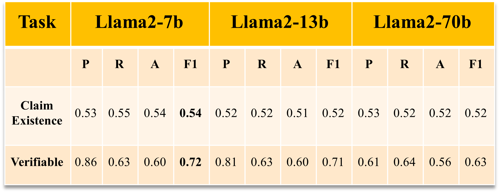

# Scientific Claim Detection and Classification Using Large Language Models

This repository contains programs for detecting and classifying COVID-19 related tweets into scienitifc claim categories. This work follows the annotation framework described by [Hafid et. al.](https://dl.acm.org/doi/10.1145/3511808.3557693)

The repository is divided into two directories - one for Llama 2 models and another one for GPT models. The Llama 2 models contains the following prompting techniques:

1. [Few Shot Prompting](https://www.promptingguide.ai/techniques/fewshot)
2. Few Shot Prompting with Guidelines
3. Few Shot Prompting with Guidelines and [Emotional Stimuli](https://arxiv.org/abs/2307.11760)
4. [Chain of Thought](https://arxiv.org/abs/2201.11903)
5. [Clue and Reasoning Prompting](https://arxiv.org/abs/2305.08377)

## Setup

Run the following command to install necessary packages for running the standalone python program for `GPT`` models:

```python
# first, activate your virtual environment

pip install openai pandas scikit-learn
```

Similarly, for `Llama 2` models:

```python
pip install requests together langchain pandas scikit-learn
```

## Running the program

1. To run the python program for `GPT` models, first set the environment variable, named `OPENAI_API_KEY` in my case:

```bash
setx OPENAI_API_KEY “<yourkey>” # for windows
echo "export OPENAI_API_KEY='yourkey'" >> ~/.bashrc # for Linux
echo "export OPENAI_API_KEY='yourkey'" >> ~/.zshrc # for mac
```

2. The Jupyter Notebook for `Llama 2` calls `TogetherAI`'s API, a third-party service which hosts several large language models including `Llama 2` and provides free credits. You can set the API key for TogetherAI likewise, named `TOGETHERAI_API_KEY` in this case:

```bash
setx TOGETHERAI_API_KEY “<yourkey>” # for windows
echo "export TOGETHERAI_API_KEY='yourkey'" >> ~/.bashrc # for Linux
echo "export TOGETHERAI_API_KEY='yourkey'" >> ~/.zshrc # for mac
```

3. To run the `Llama 2` notebook in a GPU cluster, like Coloarado State University's [Falcon HPC Cluster](https://sna.cs.colostate.edu/hpc/), you need to craft a shell script with required configuration parameters. Falcon Cluster uses Slurm scheduler to schedule jobs. Once the job is submitted to the cluster, to interact with the notebook, you need to enable port forwarding:

```bash
ssh -N -f -R $port:localhost:$port falcon # This port forwards the specified port of HPC cluster to the same port of the machine that was used to submit the job
ssh -N -f -L localhost:$port:localhost:$port <username>@<machine_name>.<domain> # This further forwards the port from the machine that was used to submit the job to your local machine
```

## Dataset

A truncated version of the dataset is available in `.csv` format.

## Results




